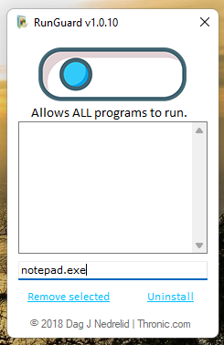
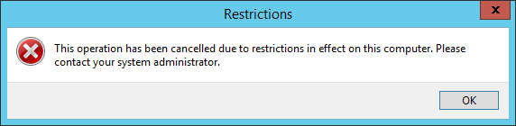

## RunGuard
RunGuard is a portable software that manages a system's [run policy](https://msdn.microsoft.com/en-us/library/ms811966.aspx)  ↗  
All changes have immediate effect, no reboots required.

## Who needs something like this?

Environments where people are sharing a single computer and should be restricted to only specific software. To prevent torrenting, installing malware, and effectively slowing down a computer and/or productivity. Like shops, schools, kids or just computer illiterate users. This program works best if the user doesn't know about it, to avoid getting the idea of just renaming executables. The messages from the system will not make that obvious by itself.

## Usage

Run on the system you want to protect and set a PIN code. A uniquely named admin-client will be created (do NOT change its name!) located in C:\RunGuard\ and is protected by the PIN. You will always be able to run this for future administration. You can delete the local copy as long as you **keep a copy of it somewhere else!** You can run it from a USB drive. TIP: Programs starting automatically at boot via HKLM & HKCU also need white listing.

## Removal

Simply click uninstall in the client, it will delete the local content.  
It require the generation of a new admin-client if you ever use it again.

## Suspicious mode, forgotten PIN or lost admin-client

RunGuard will go into a suspicious mode if the local encrypted settings are deleted. You can manually remove %program data%\RgPrevInst.tag to set a new PIN code. If you have lost the uniquely named and whitelisted admin-client, you can in a worst case no-access scenario boot from eg. an OS installation media and mount HKCU / ntuser.dat in %userprofile% temporarily under HKLM to manually edit explorer GPO.

## Changelog

-   2018.11.09 Initial Release 1.0.10  
    [🛠] Stability and bug testing performed on Windows 10 Home and Pro.